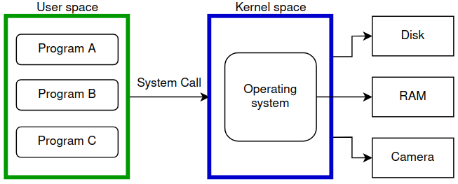

# System calls

|||objectives
After this lecture, you should be able to answer the following:
- What is user space and kernel space?
- What is a system call?
- What are man pages?
- How to track system calls?
|||

### User space and kernel space

The user space is where all programs run. Programs such as browsers, text editors and document readers all run in what we call the user space. The user space does not have access to hardware resources such as the RAM, disk and camera. You might be wondering, how does Zoom (which is running in user space) access the camera?

The kernel space is where the operating system kernel runs. The kernel is responsible for managing hardware devices, and managing all the programs running in the user space. What makes the kernel space special is that there are some CPU instructions that are only allowed to run in kernel space.

Why can't we run everything in the kernel-space?

### System calls

Let's get back to our question, how is Zoom, a program running in the user space, able to access the camera? When user space programs need to access hardware, they communicate with the operating system using system calls. System calls are a way for programs in the user space to communicate with the operating system and ask it to do certain functionality for them.

* `open` `write` `read` → file-related
* `fork` `exec` `exit` → process-related
* `socket` `send` `recv` `listen` `bind` → network-related

|||info
The full list of system calls on Linux:

https://thevivekpandey.github.io/posts/2017-09-25-linux-system-calls.html
|||

The figure below shows how system calls connect user-space with the operating system that is running in the kernel-space.

### Man pages

Linux has manual pages for each system call. To access the man pages for the `open` system call, type `man 2 open`. Man pages are amazing, they provide really good documentation for almost everything related to operating systems.

### strace

You can inspect what system calls a program makes by running it under `strace`. For example, if you want to see what system calls `program1` makes, you can do the following: `strace ./program1`. This is very useful when you want to know what a program does under the hood. Programs can't read or write files, can't access hardware or do anything worthwhile without running system calls.

| Flag | Description |
|------|-------------|
| -p PID | Attach to an already running process | 
| -o file | Write the trace output to a file |
| -c | Print a summary table |
| -f | Follow child processes created by `fork` |
| -y | Show the file path associated with file descriptors |
| -t | Add timestamps to each line |
| -e trace= | Filter by syscall category `file process network signal memeory`|

|||quiz
- What is the difference between user space and kernel space?
- What is a system call and why do programs need them?
- Why do we have user space and kernel space? Why can't we run everything in the kernel?
- What are the man pages?
- How can we use strace?
|||

Maysara Alhindi -- 2026

