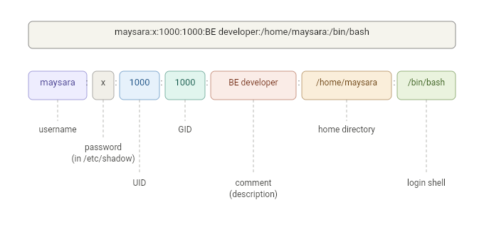

# Linux Users
|||objectives
After this lecture, you should be able to answer the following:
- What is `/etc/passwd` and `/etc/shadow`?
- Why are there so many users on a Linux machine by default?
- What is the root user?
- What is `sudo` and how does it work?
- How to add users and manage passwords?
|||

### /etc/passwd
Every user on a Linux system has an entry in the file `/etc/passwd`. You can view it by running `cat /etc/passwd`. Each line in this file represents one user and follows this format:

```
maysara:x:1000:1000:BE developer:/home/maysara:/bin/bash
```



| Field | Description |
|-------|-------------|
| username | The login name of the user |
| x | A placeholder that indicates the password is stored in `/etc/shadow` |
| UID | The user ID, a unique number that identifies the user |
| GID | The group ID, the primary group the user belongs to |
| comment | Usually the full name of the user or a description |
| home_directory | The path to the user's home directory |
| shell | The program that runs when the user logs in (e.g. `/bin/bash`) |

|||info
UIDs 0-999 are typically reserved for system users. Regular human users usually start at UID 1000.
|||

```bash
# shows your current username
whoami       
id
```

### /etc/shadow
You might have noticed that the password field in `/etc/passwd` just has an `x`. The actual passwords are stored in `/etc/shadow`. Why is that?

Each line in `/etc/shadow` contains the username, the hashed password, and information about password expiration. You can try reading it yourself:
```bash
sudo cat /etc/shadow
```

|||info
Passwords in `/etc/shadow` are not stored in plain text. They are hashed using algorithms like SHA-512. This means even if someone gains access to the file, they don't see the actual passwords.
|||

### The root user
The root user (UID 0) is the superuser. Root can do anything - read any file, kill any process, modify any configuration and access any hardware.

### sudo
`sudo` stands for **superuser do**. It lets you run a single command as root without switching to the root account.

```bash
apt install vim          # Permission denied
sudo apt install vim     # Runs as root, works
```

The list of users allowed to use `sudo` is controlled by the file `/etc/sudoers`. To give a user sudo access is to add them to the `sudo` group:

```bash
sudo usermod -aG sudo username
```

```
%sudo   ALL=(ALL:ALL) ALL
maysara ALL=(ALL:ALL) /usr/bin/apt
```

### Managing users

```bash
# To add a new user:
sudo adduser newuser
# To change your own password:
passwd
# To remove a user:
sudo userdel username
# switch to another user
su - username
```


|||quiz
- What is the difference between `/etc/passwd` and `/etc/shadow`? Why are passwords not stored in `/etc/passwd`?
- What is the root user and why should you avoid logging in as root?
- What does `sudo` do and why is it preferred over using root directly?
- Why are there many system users on a Linux machine that you didn't create?
- Can the passwords in `/etc/shadow` be cracked?
|||
<div style="text-align: center; font-size: 0.8em; color: gray; margin-top: 50px;">Maysara Alhindi -- 2026</div>