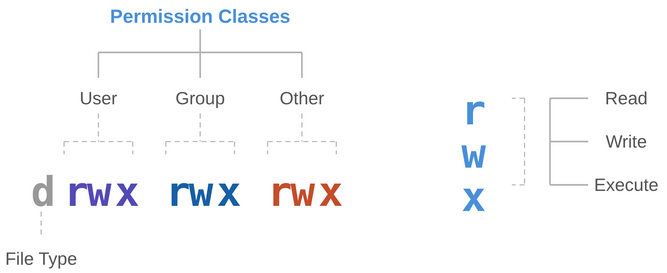

# DAC Permissions
|||objectives
After this lecture, you should be able to answer the following:
- What is DAC (Discretionary Access Control)?
- How do file permissions work in Linux?
- What are special permissions (SUID, sticky bit)?
|||

### What is DAC?
DAC stands for **Discretionary Access Control**. It is the default access control model in Linux. The word "discretionary" means that the owner of a file or directory gets to decide who can access it.

In DAC, access decisions are based on two things: the identity of the user and the permissions set on the file.

### File permissions
Every file and directory in Linux has three sets of permissions for three categories of users:

| Category | Description |
|----------|-------------|
| Owner (u) | The user who owns the file |
| Group (g) | Users who belong to the file's group |
| Others (o) | Everyone else on the system |

Each category gets three permission bits:

| Permission | On a file | On a directory |
|------------|-----------|----------------|
| r (read) | Can view the contents of the file | Can list the files inside the directory |
| w (write) | Can modify the file | Can create, delete or rename files inside the directory |
| x (execute) | Can run the file as a program | Can `cd` into the directory |

When you run `ls -l`, you see something like this:
```
-rwxr-x--- 2 maysara developers 4096 Jan 15 10:30 deploy.sh
```

The first column is the permission string. Let's break it down:



The first character indicates the type:

| Character | Meaning |
|-----------|---------|
| - | Regular file |
| d | Directory |
| l | Symbolic link |

So `-rwxr-x---` means:
- It's a regular file
- Owner (`maysara`): can read, write and execute
- Group (`developers`): can read and execute, but not write
- Others: no access at all

### Reading permissions as numbers
Each permission has a numeric value:

| Permission | Value |
|------------|-------|
| r | 4 |
| w | 2 |
| x | 1 |
| - | 0 |

You add them up for each category. So `rwxr-x---` becomes:
- Owner: r(4) + w(2) + x(1) = **7**
- Group: r(4) + -(0) + x(1) = **5**
- Others: -(0) + -(0) + -(0) = **0**

The numeric representation is **750**.

Some common permission numbers:
- `755` `rwxr-xr-x` (typical for programs and directories)
- `644` `rw-r--r--` (typical for regular files)
- `700` `rwx------` (private, only the owner can access)
- `600` `rw-------` (private file, common for SSH keys)

### chmod
`chmod` (change mode) changes the permissions of a file or directory. You can use it in two ways:

**Numeric mode:**
```bash
chmod 755 deploy.sh        # rwxr-xr-x
chmod 600 secret.key       # rw-------
chmod 644 index.html       # rw-r--r--
```

**Symbolic mode:**
```bash
chmod u+x script.sh         # add execute for the owner
chmod g-w config.txt        # remove write from the group
chmod o+r readme.md         # add read for others
chmod a+x program           # add execute for all (a = all)
chmod u=rwx,g=rx,o= file    # set exact permissions
```

**Directories:**

When changing permissions on a directory, use the `-R` flag to apply it recursively to everything inside:
```bash
chmod -R 750 /var/www/project
```

|||warning
Be very careful with recursive chmod. Running `chmod -R 777 /` would make every file on the system readable, writable and executable by everyone.
|||

|||info
When you create a new file, what permissions does it get? Check what is the purpose of `umask` command.
|||

### chown
`chown` (change owner) changes who owns a file or directory:

```bash
sudo chown sami file.txt              # change the owner to sami
sudo chown sami:developers file.txt   # change the owner and the group
sudo chown :developers file.txt        # change only the group
```

Like `chmod`, use `-R` for directories:
```bash
sudo chown -R sami:developers /var/www/project
```
Only root can change the owner of a file.

### Special permissions
Beyond the basic `rwx`, Linux has three special permission bits:

**SUID (Set User ID):**

When SUID is set on an executable, it runs as the file's owner, not the user who launched it. The classic examples are `passwd`:
```bash
ls -l /usr/bin/passwd
-rwsr-xr-x 1 root root 68208 Mar 14 12:30 /usr/bin/passwd
```

**Sticky bit:**

When set on a directory, only the file's owner (or root) can delete or rename files inside, even if others have write permission. The `/tmp` directory uses this:
```bash
ls -ld /tmp
drwxrwxrwt 15 root root 4096 Jan 15 10:30 /tmp
```

The `t` at the end is the sticky bit. Everyone can create files in `/tmp`, but you can only delete your own.

```bash
chmod +t /shared
```

### Limitations of DAC
DAC is simple and flexible, but it has real weaknesses. What are the limitations of DAC?

|||quiz
- What does DAC stand for and what makes it "discretionary"?
- What are the three permission categories and the three permission bits?
- What does `r` mean on a file vs on a directory?
- What does `chmod 750 file.txt` do? Break down each digit.
- What is the difference between `chmod` and `chown`?
- What is SUID?
- Why do we need SUID bit in Linux? What its purpose?
|||
<div style="text-align: center; font-size: 0.8em; color: gray; margin-top: 50px;">Maysara Alhindi -- 2026</div>