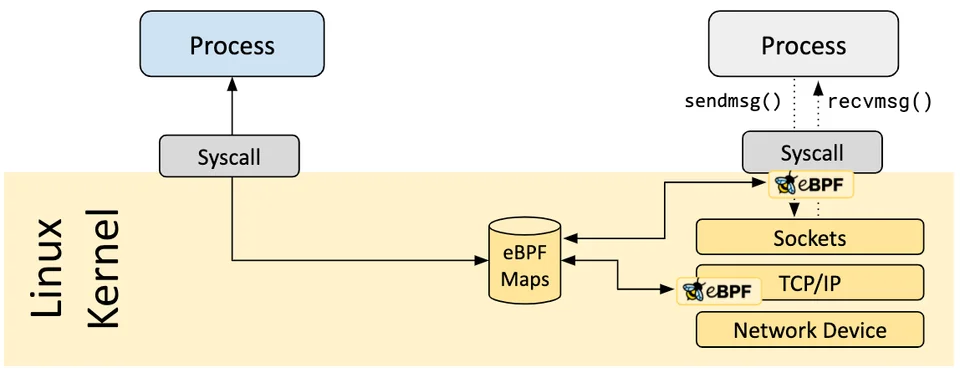

# Introduction to eBPF

|||objectives
After this lecture, you should be able to answer the following:
- What is eBPF and why is it powerful for security?
- How does an eBPF program get into the kernel safely?
- What is BCC and how does it relate to eBPF?
- How do you read a simple eBPF program?
|||

### What are we building?
In this section of our course, we are going to build a simple behavioral security monitor (simple EDS or antivirus).

- What programs are being executed right now?
- What files is a process opening?
- What network connections are being made, and to where?
- Can we block or kill something that looks malicious?

To do all of this, we need to see what every program on the system is doing at the lowest level. We need to instrument the kernel. The tool that lets us do this is **eBPF**.

### What is eBPF?
eBPF (extended Berkeley Packet Filter) lets you run small, sandboxed programs **inside the Linux kernel** without writing a kernel module or recompiling the kernel. You attach these programs to hook points (kprobes, tracepoints, XDP, tc ..).

|||info
eBPF is used in production by huge systems: Cilium (Kubernetes networking), Falco (runtime security), Katran (Facebook's load balancer), and many observability tools. It has become one of the most important technologies in modern Linux infrastructure.
|||

### Why is this safe?
A bug in kernel code can crash the whole machine. So how does eBPF let arbitrary code run in the kernel safely?

Every eBPF program must pass through the **verifier** before it is allowed to load. The verifier is a piece of the kernel that analyzes your program and rejects it unless it can prove the program is safe.

### The pieces of an eBPF system
An eBPF-based tool generally has three parts:

| Part | Where it runs | Job |
|------|---------------|-----|
| eBPF program | Kernel | Attached to a hook, collects data or makes decisions |
| Maps | Shared | Key-value stores that pass data between kernel and user space |
| User-space program | User space | Loads the eBPF program, reads the maps, shows results |



[For more information](https://ebpf.io/what-is-ebpf/)

### What is BCC?
 
**BCC (BPF Compiler Collection)** is a toolkit that makes it much easier. With BCC you write the kernel-side program in C (as a string inside your script) and the user-space side in Python. BCC compiles the C code, loads it into the kernel, handles the maps, and lets you read results in Python.

Install BCC on Ubuntu:
```bash
sudo apt install bpfcc-tools linux-headers-$(uname -r) python3-bpfcc
```

### Running existing tools
The best way to get a feel for eBPF is to run tools that already exist. [BCC ships with a lot of them](https://github.com/iovisor/bcc/blob/master/tools/execsnoop.py).


**execsnoop** - shows every new program that gets executed:
```bash
sudo execsnoop-bpfcc
```
**opensnoop** - shows every file that gets opened:
```bash
sudo opensnoop-bpfcc
```
**tcpconnect** - shows every outbound TCP connection:
```bash
sudo tcpconnect-bpfcc
```

**bashreadline** - prints every command anyone types into bash, system-wide:
```bash
sudo bashreadline-bpfcc
```

### Reading your first eBPF program
Now let's look at the smallest possible eBPF program so the magic becomes concrete:

```python
from bcc import BPF

# The kernel-side program, written in C
prog = """
int hello(void *ctx) {
    bpf_trace_printk("a program was executed!\\n");
    return 0;
}
"""

# Compile and load the program into the kernel
b = BPF(text=prog)
# Attach our function to the execve system call
b.attach_kprobe(event=b.get_syscall_fnname("execve"), fn_name="hello")

# Print a header
print("%-18s %-16s %-6s %s" % ("TIME(s)", "COMM", "PID", "MESSAGE"))
# Read and print messages as they arrive
while True:
    (task, pid, cpu, flags, ts, msg) = b.trace_fields()
    print("%-18.9f %-16s %-6d %s" % (ts, task, pid, msg))
```

|||reading
If you want more details about eBPF, there is a great book [Learning eBPF](https://www.oreilly.com/library/view/learning-ebpf/9781098135119/) by Liz Rice.
|||

|||quiz
- What is eBPF and where do eBPF programs run?
- What is a hook point? Give two examples.
- What is BCC and what two languages do you use with it?
- What does `execsnoop` show you, and what system call does it hook?
|||
<div style="text-align: center; font-size: 0.8em; color: gray; margin-top: 50px;">Maysara Alhindi -- 2026</div>