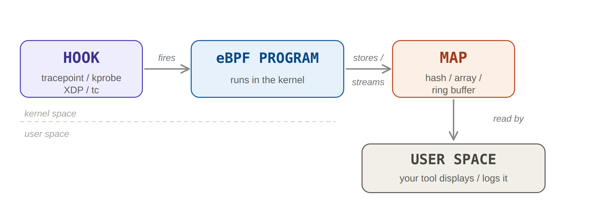

# eBPF Hook Points
|||objectives
After this lecture, you should be able to answer the following:
- What are the main places you can hook an eBPF program?
- What is the difference between a kprobe and a tracepoint?
- What are the main kinds of eBPF maps?
|||

### Where can you hook?

| Hook | What it attaches to | Used for |
|------|--------------------|----------|
| kprobe | Almost any kernel function | Tracing internal kernel behavior |
| tracepoint | Stable, named events in the kernel | Tracing well-known events like syscalls |
| XDP | The network driver, very early | Fast packet filtering on incoming traffic |
| tc | The network stack (traffic control) | Filtering incoming and outgoing traffic |

### kprobes vs Tracepoints

```sh
# Catching open system call
tracepoint: syscalls:sys_enter_openat
kprobe: do_sys_openat2

# the exact moment the kernel sets up an outgoing TCP connection
kprobe: tcp_v4_connect
tracepoint: (none exists)
```

```bash
# Every tracepoint available on this system
sudo cat /sys/kernel/tracing/available_events
# Just the syscall tracepoints
sudo grep openat /sys/kernel/tracing/available_events
# The exact fields/arguments a tracepoint gives you
sudo cat /sys/kernel/tracing/events/syscalls/sys_enter_openat/format
# Every kernel function a kprobe can attach to (very long!)
sudo cat /sys/kernel/tracing/available_filter_functions | grep tcp_v4_connect
```

```python
b.attach_tracepoint(tp="syscalls:sys_enter_execve", fn_name="my_handler")
```

```python
b.attach_kprobe(event="tcp_v4_connect", fn_name="my_handler")
```

That `format` file is especially useful: it tells you exactly which arguments a tracepoint exposes (for `sys_enter_openat` you'll see `dfd`, `filename`, `flags`, `mode`). Those are the fields you read in your program.

### XDP vs tc

XDP (eXpress Data Path) attaches an eBPF program very early in the network path, right at the network driver, before the kernel has done much work on the packet.
tc (traffic control) attaches a program a bit later in the network stack than XDP. It runs after the kernel has processed the packet more, so it has more context to work with, but it's slightly less fast than XDP.

The important difference: tc can act on both incoming (ingress) and outgoing (egress) traffic, while XDP only sees incoming traffic.


```python
b.attach_xdp(dev="eth0", fn=b.load_func("my_handler", BPF.XDP))
```

### Maps

| Map type | Shape | We'll use it for |
|----------|-------|------------------|
| Hash map | Key -> value (like a dictionary) | Blocklists, per-PID state |
| Array | Fixed-size, integer-indexed | Counters, configuration |
| Ring buffer | Ring with two pointers | Streaming events  |

### Putting it together



You pick a hook (where to observe or act), which determines the program type (what data you get), and you use maps to keep state and to pass results to user space. That's the whole model.

For the monitor we build next lecture:
- To see every program launched -> a tracepoint on `execve`
- To see every file opened -> a tracepoint on `openat`
- To watch and block outgoing connections -> a tc program on the network interface
- To stream all these events to our user-space tool -> a ring buffer
- To hold the list of blocked IPs -> a hash map

|||quiz
- What is the difference between a kprobe and a tracepoint?
- Which file lists all available tracepoints?
- Why can XDP not be used to monitor outgoing traffic?
- Name the three map types covered and what each is good for.
|||

<div style="text-align: center; font-size: 0.8em; color: gray; margin-top: 50px;">Maysara Alhindi -- 2026</div>